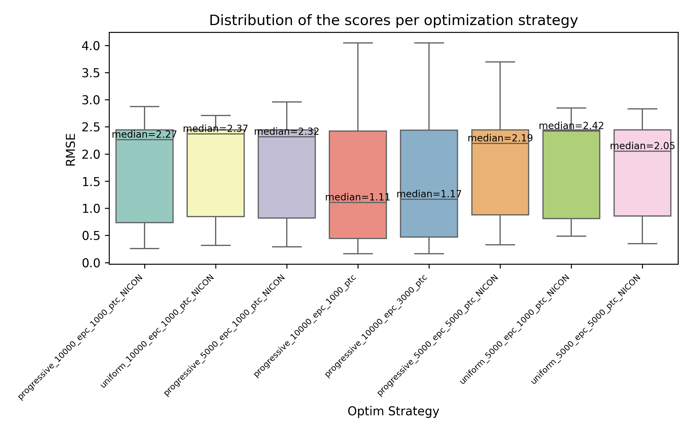
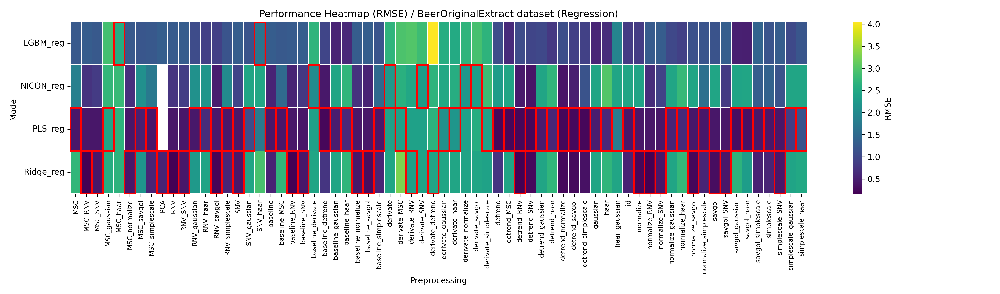
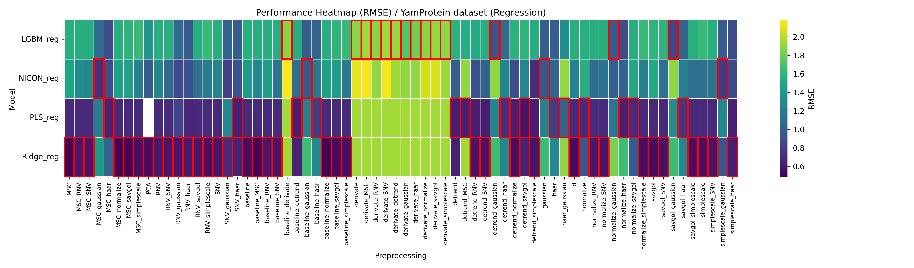
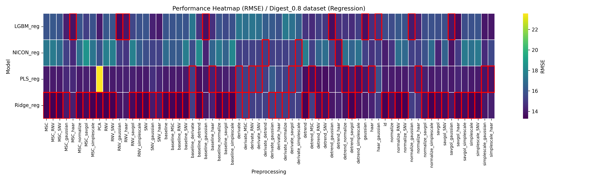

### Résumé rapide
	- **Rappel**: je travaille sur les combinaisons preprocessing-modèle (e.g. -> Heatmaps). Les modèles utilisés sont PLS, Ridge, LGBM, NICON. Les combinaisons de preprocessings vont jusqu'à 2 preprocessings différents pour le moment
	- J'ai enfin obtenu la convergence de NICON (résolution d'un problème pytorch idiot).
	- Implémentation d'une **optimisation progressive** pour NICON: recherche optuna approfondie sur un espace d'hyperparamètres large pour la première combinaison preprocessing-NICON; recherche optuna plus restreinte pour les combinaisons preprocessing-NICON suivantes.
	- Stratégie du batch_size maximal: on garde le batch_size qui est accepté par le GPU pour faire l'entraînement
	- Comparaison des méthodes d'optimisation: optimisation progressive vs optimisation normale
	- Obtention de heatmaps pour les bdd de régression
- ### Quelques détails
	- #### Optimisation progressive NICON
		- **Problématique**: NICON est optimisé et calibré sur un grand nombre de preprocessings, ce qui représente un temps de calcul conséquent. On est alors contraint de réduire dans la phase d'optimisation optuna le nombre d'essais d'hyperparamètres, et le nombre d'epochs d'entraînement. Pour les grosses bases de données, on est de l'ordre pour optuna de: n_epochs = 10, n_trials = 90. C'est pas génial (Pruning, early stopping compris même pour optuna).
		  Pour la phase de calibration finale, en revanche, avec les meilleurs hyperparamètres trouvés par optuna, on fait une calibration sur 5000 voire 10000 epochs, avec Earlystopping et checkpointing. Le learning rate est cyclique et fait 4 cycles complets sur l'ensemble des epochs. Il oscille entre $10^{-6}$  et $10^{-3}$. C'est bien opérationnel, tout est vérifié visuellement via Tensorboard.
		- Pour pallier ce troncage de l'optimisation par optuna, je propose la méthode suivante. Pour le premier preprocessing testé, on fait une recherche poussée du meilleur jeu d'hyperparamètres: 200 trials, 100 epochs par trial.
		- On obtient par exemple un kernel_size1 optimal de 11. Pour le second preprocessing, on garde 40% de la largeur de l'intervalle de recherche maximal, autour de la valeur 11. Ici l'intervalle de recherche maximal est $[3; 25]$. Donc on se retrouve avec l'intervalle $[7; 15]$ pour la recherche optuna.
		- Pour le $n^{\text{ème}}$ preprocessing, pour un hyperparamètre h, on prend la médiane des n-1 premiers hyperparamètres h optimaux pour définir le centre de l'intervalle autour duquel on concentre la recherche optuna.
		- Pour les preprocessings après le premier, on fait une recherche optuna sur 30 essais, 10 epochs par essai.
	- #### Stratégie du batch_size maximal
		- **Problématique**: Ce qui est souvent effectué dans la calibration d'un modèle de deep, c'est le test de plusieurs tailles de batch pour trouver laquelle entraîne la meilleure convergence.
		  En théorie, plus la taille de batch est grande, plus l'estimation du gradient pour minimiser la fonction d'erreur est robuste et précise. 
		  En pratique, il existe des cas où ce sont les petites tailles de batch qui vont mener à de meilleures convergences, parce qu'elles évitent de trop "coller" aux données.
		  Donc typiquement on peut avoir l'idée d'intégrer la taille de batch comme hyperparamètre de recherche d'optuna.
		- Cependant, cette stratégie mène à un biais significatif: comme expliqué précédemment, la recherche optuna est faite sur peu d'epochs par essai, donc sur des modèles qui n'ont pas le temps de converger. Or, en 10 epochs par exemple, avec une petite taille de batch, le gradient et les poids du modèle sont mis à jour bien plus de fois qu'avec une grande taille de batch, et donc le modèle converge plus rapidement. 
		  Cela implique, comme la convergence n'est pas finie lorsqu'Optuna stoppe l'essai, que les meilleurs résultats évalués seront généralement ceux associés aux petites tailles de batch, puisqu'avec un plus grand nombre de mises à jour des poids, le modèle aura appris plus vite.
		- Pourtant dans la phase de calibration finale avec beaucoup plus d'epochs, le modèle a le temps de converger, et dans ce cas les petites tailles de batch ne donnent pas forcément les meilleures convergences (pour les raisons théoriques expliquées plus tôt).
		- **Solution proposée**: Trouver la taille de batch maximale acceptée par le GPU pour la phase de calibration. On peut alors fixer la taille de batch, et ne pas avoir à tester plusieurs valeurs possibles. Cela peut cependant mener à des biais comme expliqué dans la problématique.
		  L'algorithme a été mis en place et est opérationnel.
	- #### Comparaison des méthodes d'optimisation
		- Voici un petit graphique sur BeerOriginalExtract qui compare ma méthode d'optimisation progressive, avec la méthode classique où tous les emplois d'optuna sont identiques, une optimisation que j'ai appelée uniforme.
		- {:height 457, :width 718}
		- Les boxplots représentent l'ensemble des valeurs d'une heatmap. Quand en abscisse, le nom finit par NICON, c'est que les performances sont évaluées seulement sur le modèle NICON. Les indications epc et ptc correspondent au nombre d'epochs et la patience respectivement dans la phase finale de calibration du modèle NICON.
		- On voit qu'il n'y a pas de grande différence entre uniforme et progressif en termes de performances, en revanche le temps de calcul est très différent, à l'avantage de la méthode d'optimisation progressive.
		- J'essaierai d'obtenir plus de graphiques, un peu plus évocateurs, dans ce style et sur d'autres bdd.
	- #### Obtention de heatmaps pour les bdd de régression
		- Pour la bdd BeerOriginalExtract:
		- 
		- Les encadrés rouges montrent les RMSE minimales par preprocessing.
		- Pour la bdd YamProtein:
		- 
		- Pour la bdd Digest_0.8:
		- 
		- Cette dernière heatmap est améliorable, je vais retirer la valeur aberrante pour rescale la heatmap correctement.
		- On remarque que le preprocessing derivate (dérivée du premier ordre) provoque une diminution significative des performances de tous les modèles. J'ai pourtant vérifié, j'ai laissé les paramètres par défaut, et ça fait bien une dérivée première du signal. J'utilise la méthode issue de nirs4all.transformations.