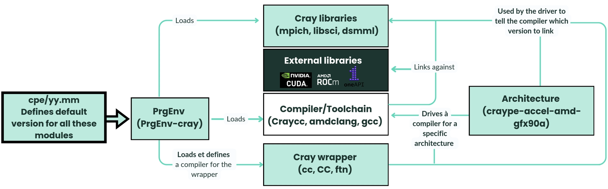
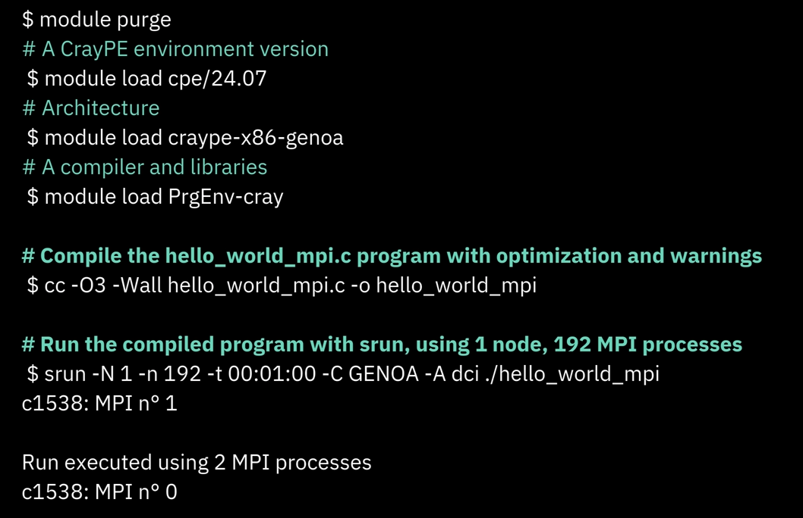
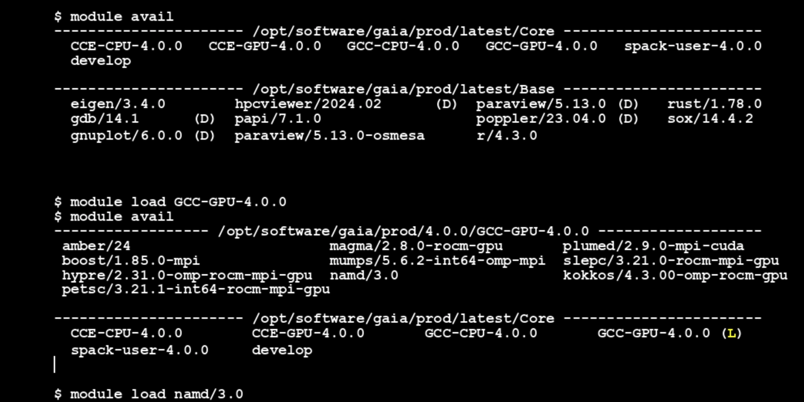
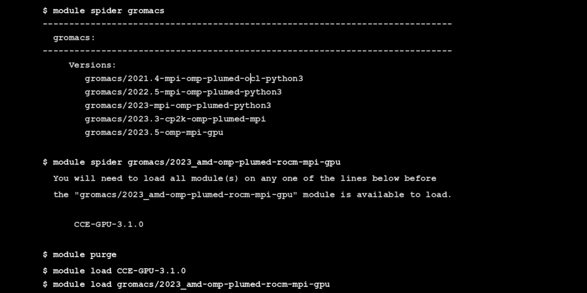
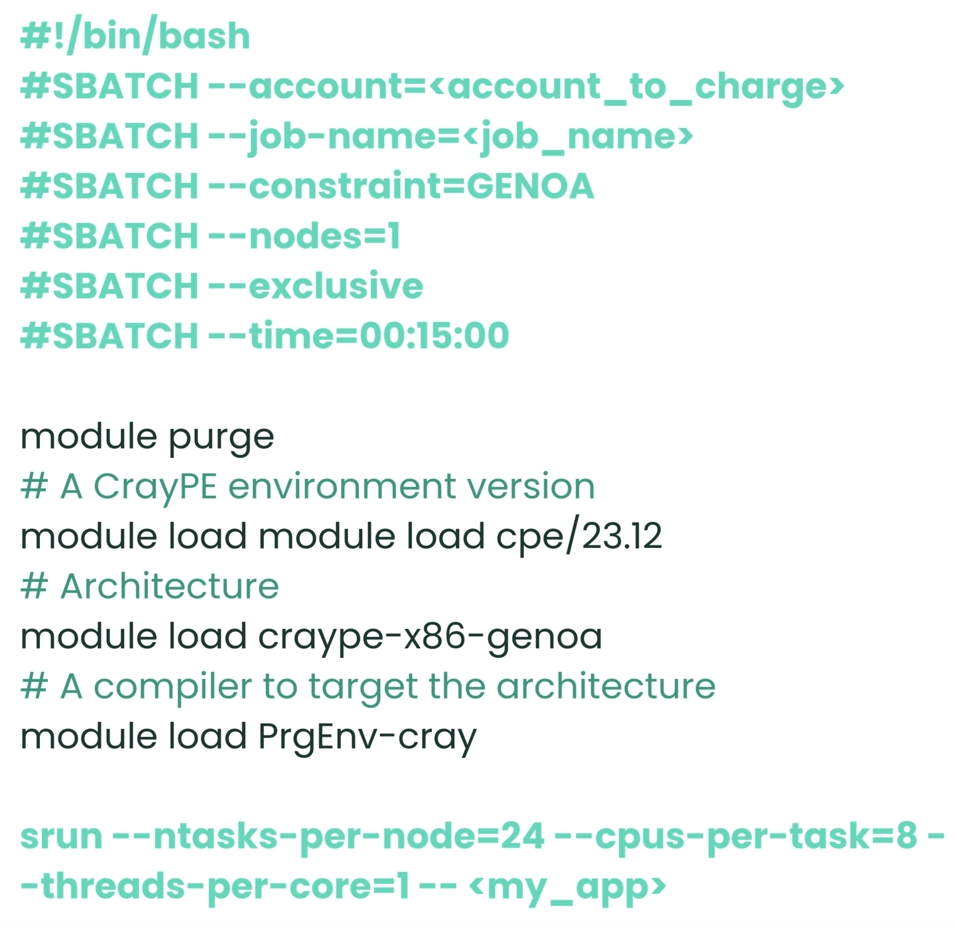
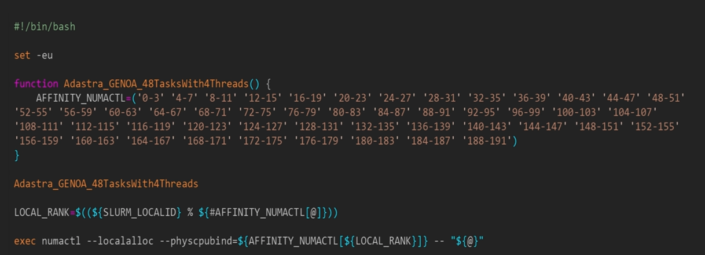
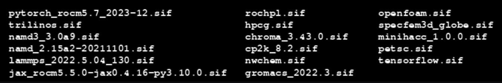
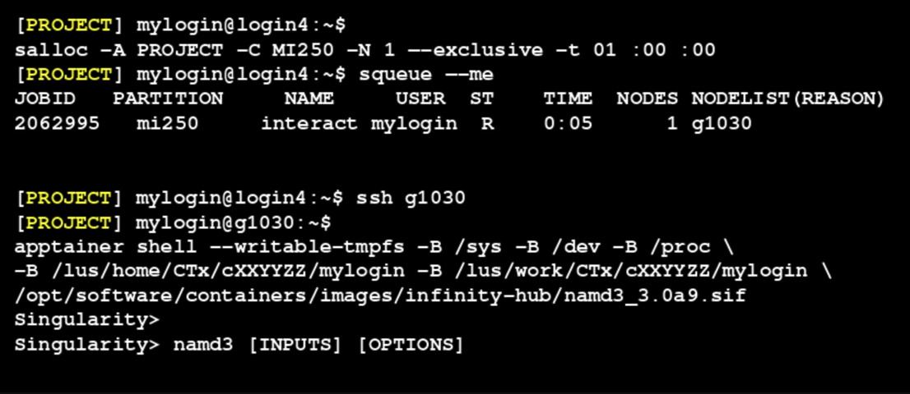
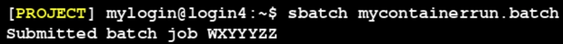
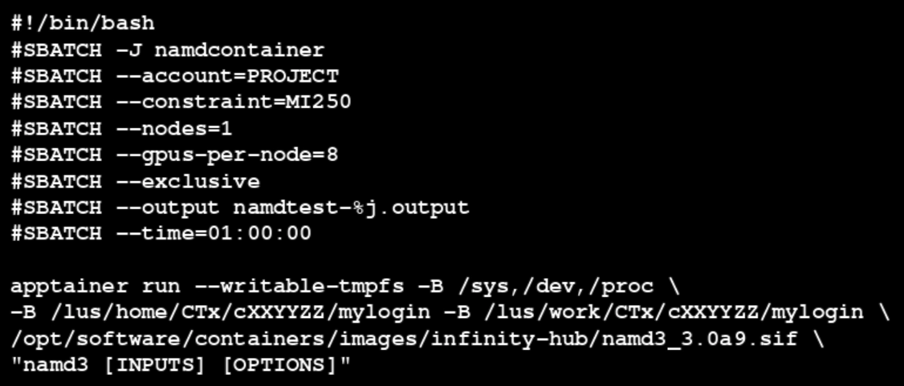

## Adastra
collapsed:: true
	- ### Administratif
		- **numéro de dossier** : AD011017070
		- Heures attribuées initialement CINES Adastra Genoa : 200 000 (heures cœurs)
		- Heures attribuées initialement CINES Adastra MI300A : 5 000 (heures GPU)
		- **documentation technique** Adastra : [https://dci.dci-gitlab.cines.fr/webextranet/](https://dci.dci-gitlab.cines.fr/webextranet/)
		- En cas de problème technique, ne pas hésiter à contacter l'équipe support aux utilisateurs: svp@cines.fr
		- Pour toute publication réalisée avec les ressources d’Adastra, les mentions OBLIGATOIRES à inscrire dans les articles sont :
			- Version française : « Ces travaux ont bénéficié d’un accès aux moyens de calcul du CINES au travers de l'allocation de ressources 20XX-[numéro de dossier] attribuée par GENCI »
			- Version anglaise (longue) : « This work was granted access to the HPC resources of CINES under the allocation 20XX-[numéro de dossier] made by GENCI »
			- Version anglaise (courte) : « This work was performed using HPC resources from GENCI-CINES (Grant 20XX-[numéro de dossier]) ».
		- Contact GENCI: [https://www.edari.fr/documentation/index.php/Contact](https://www.edari.fr/documentation/index.php/Contact)
	- ### Stockage
		- 4 espaces de stockage:
			- **Home**: Faible capacité, sauvegardé quotidiennement 
			  -> Fichiers d'environnement & code source, développement sauf env python/conda ou datasetIA à mettre sur le work
			- **Scratch**: Espace de travail pendant les calculs, purge des fichiers après 30 jours
			  -> À privilégier pour les calculs mais pas pour la conservation des résultats
			- **Store**: Données à sauvegarder sous forme **d'achives .tar**
			  -> Conserver des données à très long terme comme résultats de calculs
			- **Work**: Non sauvegardé, non supprimé
			  -> Stockage des jeux de données, env python/conda
		- Transfert de fichiers entre les espaces de stockage:
			- un noeud de transfert inter-centres TGCC-IDRIS-CINES (noeud CCFR)
			- par exemple: si on a compte au TGCC et on veut transférer des données sur adastra ou inversement, on peut se connecter au noeud CCFR d'adastra depuis les machines JeanZay et Irene en faisant un ssh sur adastra-ccfr.cines.fr
	- ### Accès et connexion
		- 2 modes de connexion: ssh et visu:
			- connexion ssh -> depuis un terminal: ssh mylogin@adastra.cines.fr
			- connexion visu -> Services de visualisation: dans le navigateur web, https://adastra.cines.fr accessible seulement depuis les ip déclarés au CINES
	- ### Environnement d'Adastra
		- #### Les modules Lmod
			- Spécifient les chemins d'installation / Modification des variables d'environnement (`PATH`, `LD_LIBRARY_PATH`, etc) / Gestion des dépendances entre modules & résolution des conflits éventuels
			- **Liste de commandes très utilisées** pour les modules:
				- module avail -> affiche la liste des modules disponibles
				- module load/unload -> charge/décharge un module spécifique
				- module purge -> Décharge tous les modules actuellement chargés
				- module spider -> Recherche des modules contenant un mot-clé spécifique
				- module show -> Affiche les caractéristiques du module
		- #### Environnement Cray
			- **Modules cpe** (cray programing environment) -> mettent à jour tous les modules de l'envionnement de programmation cray vers la version YY.MM de cpe de façon automatique
			- **Modules d'architecture**: 
			  Configurent automatiquement l'environnement pour définir les options de compilation adaptées aux architectures sous-jacentes & nécessaires au run time
				- **GPU**: craype-x86-trento (AMD trento) + craype-accel-amd-gfx90a (MI250x)
				- **CPU**: craype-x86-genoa
				- **APU**: craype-x86-genoa + craype-accel-amd-gfx942
			- **Modules PrgEnv**: 
			  Configurent un environnement pré-défini en chargeant plusieurs modules
				- PrgEnv-cray, PrgEnv-aocc, PrgEnv-intel, PrgEnv-gnu, PrgEnv-amd
				- Les modules PrgEnv chargent par exemple un compilateur.
				  Il y a plusieurs **compilateurs** possibles -> craycc (CCE), amdclang (AMD), gcc (GNU), icc (INTEL)
				- Les compilateurs sont fournis avec des **wrappers** Cray (cc, CC, ftn)
				- **Bibliothèques Cray**:
					- MPI: Cray-mpich
					- blas, lapack: Cray-libsci
					- Autres: Cray-fftw, Cray-hdf5, Cray-netcdf, ...
				- **Bibliothèques externes**:
					- ROCm (hip, rocBLAS/hipBLAS, rocFFT/hipFFT, ...) (exploitation des GPU)
					- MIOpen, RCCL
					- OneAPI, CUDA
			- **Interactions entre les composantes de l'environnement Cray**:
				- **Les compilateurs**: Gnu (gcc, g++, gfortran) / AMD (AOCC) (clang, clang++, flang - LLVM based) / Cray (craycc, craycxx, craftn - LLVM based, except for crayftn) / AMD (amdclang, amdclang++) / Intel (icc, icpc, ifort)
				- Charger un **module PrgEnv-compilateur** active un **wrapper compilateur** (driver) qui:
					- **Interprète les variables d'environnement** définies par d'autres modules cray comme le module d'architecture ou le module cray-mpich
					- Utilise les infos de l'environnement pour spécifier les **chemins d'inclusion**, les **options de liaison** et les **options spécifiques à l'architecture** CPU/GPU
					- **Configure la chaîne d'outils** nécessaire pour la compilation adaptée et optimisée d'un exécutable
				- 
				- **Conclusion:** les modules PrgEnv et wrapper simplifient la gestion des dépendances et optimisent la compilation en générant automatiquement les options de compilation, et en s'assurant que les bonnes bibliothèques et que les bons en-tête sont utilisés, ce qui facilite la vie des chercheurs sur les systèmes cray
			- **Exemple de compilation d'un hello world**
				- 
				- "module purge" -> nettoie l'environnement
				- "module load cpe/24.07" -> charge une version spécifique de l'environnement cray, le module cpe, qui se propagera dans les modules suivants
				- "module load craype-x86-genoa" -> charge l'architecture cible (ici machine CPU Genoa)
				- "module load PrgEnv-cray" -> charge l'environnement de programmation cray qui contient les compilateurs et les bibliothèques nécessaires pour compiler et exécuter les applications sur le système cray
				- "cc -O3 -Wall hello_world-mpi.c -o hello_world_mpi" -> compile le fichier source avec l'optimisation O3
				- "srun -N 1 -n 132 -t 00:01:00 -C GENOA -A dci ./hello_world_mpi" -> on exécute le programme avec srun en utilisant 1 noeud ("-N 1") et tous les coeurs du noeud (192 processus MPI, "-n 192") sur les noeuds de type Genoa. 
				  Option additionnelle "-craype-verbose" -> affiche la ligne de commande exacte générée par le wrapper cray. Ça aide à mieux comprendre son fonctionnement et son rôle
		- #### Pile logicielle CINES
			- On a vu la pile logicielle Cray/HPE ("opt/cray/"): environnement Cray vu précédemment
			- Il y a aussi la pile logicielle CINES ("/opt/software/")
			- Évolue au cours du temps, avec maj système et maj logiciel (1 à 2 fois par an)
			- 3 catégories:
				- Production -> pile stable et supportée, à privilégier
				- Develop -> accessible via le module develop, accès à la future stack logiciel en production, utilisation plus risquée
				- Archive -> accessible via le module archive, versions dépréciées et non maintenues. Bien pour les chercheurs et doctorants qui veulent une version stable sur la durée de leurs travaux
			- pile logicielle "base" déployée avec le compilateur GNU
				- modules directement accessibles (pas de besoin de charger modules extensibles)
				- inclut des outils de debugging, de visu & bibliothèques scientifiques
				- permet de compiler des applications en utilisant des librairies basiques, évite de recompiler toutes les dépendances de ces applications
			- les piles en production, en développement ou archivées, sont des piles "extensibles" accessibles via des modules spécifiques de la forme <COMPILER>-<CPU|GPU>-<VERSION>
			  Il y a une version par:
				- Architecture (GPU et CPU)
				- Compilateur (gcc -> GNU et cce -> Cray)
			- module spack-user-<version> -> installer nous-même les logiciels et librairies via un Spack pré-configuré pour la machine Adastra
			- **Exemple d'utilisation:**
				- 
				- "module avail" -> affiche les modules disponibles sur la machine
				- "module load GCC-GPU-4.0.0" -> charge le module qui permet d'activer la vue des modules compilés avec l'environnement GNU pour l'archi GPU de la version 4.0.0
				- "module avail" -> affiche les applications installées avec l'environnement GNU pour l'archi GPU
			- **Utilisation de la commande spider, exemple:**
				- 
				- "module spider gromacs" -> affiche les versions disponibles de gromacs
				- "module spider gromacs/2023_amd-omp-plumed-rocm-mpi-gpu" -> version récente de gromacs choisie; affiche quel(s) module(s) charger pour garantir un environnement cohérent et utiliser la bonne version de gromacs
				- **Conclusion:** bon outil pour vérifier qu'on charge les bons modules
	- ### Job manager
		- Serveurs distribués dans la machine Adastra
		- Les jobs vont se distribuer dans ces serveurs au fur et à mesure de la disponiblité des noeuds -> Il faut un gestionnaire pour exécuter ces jobs dans la machine
		  -> Organise, priorise les tâches des différents utilisateurs à l'intérieur de la machine
		- Les jobs qu'on soumet ont différentes tailles, différentes durées, des besoins en ressources différents (CPU/GPU). Le job manager va organiser ça par **priorités** (nouvel utilisateur vs ancien utilisateur / besoin de beaucoup de noeuds vs pas beaucoup / ...), il met en place la **file d'attente** et la réorganise en permanence.
		- Quand la ressource dont on a besoin se libère, le job manager va **placer les tâches dans les noeuds de façon optimale**, i.e. au plus proche les unes des autres.
		- **Script SLURM standard:**
			- **Champs obligatoires:**
				- "account" -> le projet auquel on a eu notre allocation DARI (pas le login)
				- "constraint" -> le type de machine (GENOA, MI250, MI300, HPDA)
				- "nodes" -> le nombre de noeuds de calcul nécessaires
				- "time" -> temps de calcul sur les noeuds, mettre un temps légèrement supérieur à la durée des jobs (24h max, ne pas mettre systématiquement le max pour éviter de monopoliser les ressources pour rien)
				- **Exemple de script SLURM:**
					- 
					- "--job-name" -> nom du job pour s'y retrouver quand il y en a plusieurs lancés à la fois
					- "--exclusive" -> ce paramètre impose que le noeud ne soit pas partagé avec d'autres utilisateurs, la totalité du noeud est consommée
				- **Placement des tâches sur la partition CPU d'Adatra:**
					- La rapidité d'un coeur à accéder à de la donnée est non uniforme selon la position de la donnée -> Non Uniform Memory Access (NUMA)
					- Dans les noeuds, il y a une notion de **proximité** aussi **au niveau des coeurs de calcul**
					- Il faut donc éviter les accès lents -> utiliser un ensemble de coeurs partageant un régime d'accès uniforme
					- Ce procédé de placement est appelé "binding": on "bind" un processus sur un **sous-ensemble de coeurs**
					- Les tâches qui s'exécutent dans un noeud peuvent être mal distribuées -> mauvaise communication entre elles -> latence, perte d'efficacité
					- Il faut donc donner les bons arguments au job manager quand on lance les jobs. Par exemple:
						- Ligne de commande: "srun --cpu-bind=none -- ./adastra_binding.sh <executable> <arguments>" 
						  Puis:
						- 
						- Complexe, mais permet d'exploiter au maximum les ressources de la machine
					- Doc à regarder pour cette paramétrisation:
					  -> https://dci.dci-gitlab.cines.fr/webextranet/porting_optimization/index.html#proper-binding-why-and-how
					  -> https://dci.dci-gitlab.cines.fr/webextranet/porting_optimization/detailed_binding_script.html#adastra-detailed-binding-script
					- Cela permet de réaliser des bindings (placement explicite des rangs (MPI) sur les coeurs)
					- Deux façons de faire le binding:
						- **srun:**
							- Dépend de la configuration de SLURM
							- Difficile à déchiffrer
						- **Binding script:**
							- Facile à lire, mais nécessite compréhension du matériel
							  Sous le capot: numactl, taskset, hw-bind
		- ### Les conteneurs d'applications HPC sur Adastra
			- #### Types de conteneurs sur Adastra
				- Docker ? -> Pas optimisé pour HPC, pas dispo sur Adastra
				- Adastra **Apptainer**; ou compatible Singularity CE
					- Le support cines peut convertir des dockers complets en conteneurs Singularity
					- Conteneurs prêts à emploi, notamment conteneurs AMD Infinity Hub
					  /opt/software/containers/images/infinity-hub/ (applications comme pytorch, gromacs, ...)
					  La liste des applications:
					- 
				- Conteneurs personnels:
					- Télécharger le conteneur dans son espace (utiliser l'accès ssh, faire un scp pour verser le .sif sur l'espace perso adastra)
					- Envoyer une demande svp@cines.fr (vérification de sécurité)
					- Si accepté, mise à disposition dans l'exécutable
					  -> opt/sofware/containers/users/[project]
			- #### Comment lancer un conteneur?
				- Deux façons de lancer le conteneur:
					- **mode interactif**
						- Depuis un noeud de calcul:
						  "apptainer shell [options] [binds] container.sif"
						  Exemple de script:
						- 
						- Première commande -> Réserve un noeud de calcul sur la partition sur laquelle on veut travailler
						- Deuxième commande -> Affiche le noeud qui nous a été assigné
						- Troisième commande -> Depuis le noeud de login, la commande permet de rentrer sur le noeud de calcul
						- Quatrième commande -> Lancement du conteneur, on peut binder différents espaces de fichiers dans ce conteneur (conseillé: espace de fichiers temporaires, espaces "dev" "proc" et "sys", espaces de fichiers utilisés dans le job -> home, work ou scratch)
						  Puis chemin complet vers le conteneur choisi
						- Entrée dans le conteneur choisi pour exécuter les calculs
					- **mode batch**
						- Depuis un noeud de login, on lance un script de batch:
							- 
							- Exemple de script de batch:
							- 
							- Exemples de scripts de batch dans la documentation
- ## JeanZay
	- ### Admin
		- mdp première connexion: Zà^)ir+/